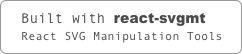

# 🎛 React Rotary Knob

[Demo](https://hugozap.github.io/react-rotary-knob/storybook)

[CodeSandbox basic example (uncontrolled)](https://codesandbox.io/s/xo0z2kkqq)

[CodeSandbox custom skin pack](https://codesandbox.io/s/6w9vqn0x3w)

💙  [Get the new skin pack (18 skin set)](https://github.com/hugozap/react-rotary-knob-skin-pack)

## Features

- Precise mode: Doesn't jump on dragging (Increase drag distance for more precision)
- Works in both controlled (recommended) and uncontrolled mode.
- Support arrow keys.
- **Supports custom skins**

<a href="https://github.com/hugozap/react-svgmt">  </a>


## Precision mode


When precision mode is active (default), a minimum dragging distance
is required to unlock de control. 

## Usage (Controlled mode - recommended)

Similar to controlled mode for HTML input controls,
you need to store the value and use the `value` and `onChange`
props to update it. This is the recommended usage.

```jsx
class App extends React.Component {

  state = {
    value: 50
  }

  changeValue(val) {
    this.setState({value:val})
  }

  render() {
    return <Knob onChange={this.changeValue.bind(this)} min={0} max={100} value={this.state.value}/>
     
  }
}
```

## Usage (Uncontrolled mode)

In uncontrolled mode the component manages its own state.
Instead of providing a `value` prop you should define a default value
with the `defaultValue` prop. Use the `onChange` prop if you want to
be notified when the value changes.

```jsx
class App extends React.Component {

  changeValue(val) {
   console.log('The value changed to '+val)
  }

  render() {
    return <Knob defaultValue={0} min={0} max={100} onChange={this.changeValue.bind(this)}  />
  }
}
```
### Non-endless behavior

For some applications it's not a good idea to jump from min to max values.
If you need to limit the rotation take a look at this implementation of a limited knob

https://codesandbox.io/s/qvyyyvv346


### Api

Props:

| Prop | Description | Default Value |
|-----|--------------|----|
| min | Minimum value| 0 |
| max | Maximum value| 100 |
| value | Control Value | 0 |
| defaultValue | start value for uncontrolled mode | 0 |
| onChange | Callback with the updated value | |
| unlockDistance | Minimun drag distance required to unlock the knob | 100 |
| step | the step distance (when using the keyboard arrows) | 1 |
| skin | Skin object| |
| onStart | Called when the dragging starts |
| onEnd | Called when the dragging ends |
| clampMin | degree value to move the starting point of the active area of the knob away from the center | 0 |
| clampMax | degree value to move the end point of the active area of the knob away from the center | 360 |
| rotateDegrees | degree value to rotate the knob component to have the starting / end points at a different position | 0 (zero is at top |


### Custom skins

See defaultSkin.js for an example.

- [Custom skin pack](https://github.com/hugozap/react-rotary-knob-skin-pack)

- [Custom skins demo (uses flubber to morph paths)](https://hugozap.github.io/react-rotary-knob-custom-skins-demo/)


